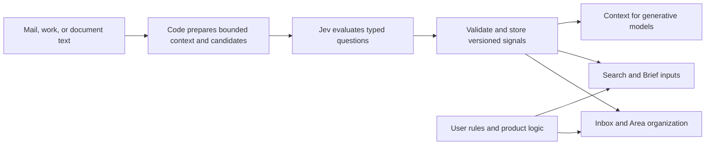

# Jev research for Albatross — September 21, 2026

Historical research, captured before implementation. See [the shipped mail integration and validation notes](jev-implementation-2026-09-21.md) for the resulting changes.
**Jev is a strong candidate for a shared classification service across Albatross.** Its most useful role is to turn mail, work descriptions, retrieved evidence, and document text into a small set of typed signals. Product code can reuse those signals for organization, retrieval, and presentation. The first experiment should cover mail categories and reply-needed detection; Area matching is the next substantial opportunity.

This assessment combines official documentation, SDK source, two independent published experiments, inspection of this repository at `e1e95b49`, and a live synthetic probe. Findings about possible Albatross integrations are engineering proposals, not measured improvements to the application. No application behavior was changed.

Browserbase Search was attempted twice and Browserbase Fetch once. All failed because the connector could not open `/home/jjalangtry/.openclaw/openclaw.json`. Research continued with web search and page retrieval. The live model probe used the existing process-level OpenRouter credential and exclusively synthetic text; customer mail and production records were not used. Reproduction code and complete responses are in [smoke.py](jev-2026-09-21/smoke.py) and [smoke-results.json](jev-2026-09-21/smoke-results.json).

**Follow-up:** the browser-session tools subsequently became available and worked. The deeper [mail relevance investigation](jev-mail-relevance-2026-09-21.md) uses Browserbase, reproduces current Brief/search failures, and adds 120 live synthetic Jev calls. It also corrects the initial integration recommendation below: the background sweep already attempts model classification for every latest message; the Brief independently recomputes categories and uses the uncertain-only path. Sharing one accepted result and repairing selection logic are prerequisites to the proposed replacement.

**The output boundary matters more than the marketing category.** TypeSafe calls Jev a System One model. Its interface evaluates supplied state against typed questions, with each question evaluated independently. This fits classification, scoring, and matching particularly well. It does not supply an arbitrary JSON-schema text generator. A JSON object containing a newly written title, summary, or explanation still needs a generative model or application code. [TypeSafe introduction](https://docs.typesafe.ai/introduction)

The available primitives map cleanly to product needs:

| Primitive | Returned information | Albatross example |
| --- | --- | --- |
| Choice | One supplied option, a distribution over options, and confidence | Existing mail category or Work shape |
| Noul | Probability of a yes answer; no separate confidence field | Whether a message explicitly requests a reply |
| Score | Expected position on an ordered rubric, its distribution, and confidence | Degree of relevance to a search query |

Choice supports up to 255 options. Use separate Noul questions when several labels can simultaneously apply; a single Choice selects one option. Include an explicit absent/none outcome when nothing may fit. [Choice reference](https://docs.typesafe.ai/primitives/choice), [Noul reference](https://docs.typesafe.ai/primitives/noul)

Score accepts 2–10 described levels. Its fractional result is an expectation over level indices, not an extracted number or a physical measurement. An invoice total should come from source text and a numeric parser, never from a Score. Write self-contained descriptions for each level. [Score reference](https://docs.typesafe.ai/primitives/score)

**Current direct-service facts are favorable, with early-service limits.** These values were checked on September 21 and can change:

| Property | Published value |
| --- | --- |
| Version | `jev-1.13.0` |
| Input price | $0.042 per million input tokens |
| Output price | Free |
| Request budget | 64K tokens for state plus all questions |
| Per-question budget | 32K tokens for state plus the longest question |
| Published limits | 250,000 tokens/second and 1,200 requests/minute; explicitly subject to change |
| Input | Text, including structured JSON state; no native image/audio/video input |
| Languages | English is strongest; other languages require task-specific evaluation |
| Customization | Instructions, criteria, and supplied context; no customer fine-tuning or LoRA |

Both `jev-latest` and `jev-preview` currently resolve to the listed version. Log the returned version and pin an evaluated release when possible. Gateways can expose different identifiers and limits. [TypeSafe models](https://docs.typesafe.ai/models)

**The live probe establishes access and basic feasibility.** At 20:24 UTC, the saved experiment sent 28 short, hand-authored fixtures twice, sequentially, through OpenRouter's Decisions API. Expected labels were defined before calling the service. There were no retries, and the request timeout was 15 seconds. A separate two-question preflight preceded the saved experiment.

| Measurement | Result |
| --- | ---: |
| Saved requests | 56 |
| Successful responses with usable typed answers | 56 |
| Matching expected fields | 86 / 88 |
| Responses matching every expected field | 54 / 56 |
| Median request latency | 300.46 ms |
| Observed p95 request latency | 401.90 ms |
| Observed latency range | 244.40–532.28 ms |
| Input tokens | 24,886 |
| API-reported total cost | $0.001045212 |
| Requests with reported cost | 56 / 56 |
| Returned model | `typesafe/jev-1.13-20260917` |

Mail contributed 46/48 matching fields; Ask/Hold labels, evidence relationships, and candidate extraction contributed 16/16, 16/16, and 8/8 respectively. All reported costs matched the input-token tariff. Saved Choice distributions and confidence ranges also passed offline checks. [Complete measurements](jev-2026-09-21/smoke-results.json)

Both disagreements were on the same fixture: a newest message thanking someone and saying no reply was needed, followed by a quoted older request. Jev correctly returned low reply-needed probability, but labeled the message transactional instead of the fixture's expected other category. Its Choice confidence was 0.55 and 0.48. This may reflect a category-boundary disagreement as much as a model failure; the labels were left unchanged. Several returned probabilities also differed across repeated calls, so integration should not assume identical numeric outputs.

These are 28 unique synthetic cases, not 56 independent examples. The probe uses a simplified taxonomy rather than the production Smart Category prompt. It contains only one Spanish example and two simple adversarial examples. It does not measure calibration, long threads, attachments, large candidate sets, Score quality, parallel question scaling, production load, or improvement over the current model. The Noul cutoff of 0.5 was a scoring convention, not a recommended product threshold. Its latency includes this environment's network and OpenRouter; it is not a regional production SLO. The preflight cost an additional $0.000016926, bringing total reported research-call cost to $0.001062138.

**Published comparisons support experimentation, but do not justify a universal speedup claim.** TypeSafe's launch report gives 70–500 ms response times and headline workflow gains of 193.6× speed and 444.6× cost. The report says measurements generally originated on the US West Coast, its short demonstration favors Jev, and headline gains are toward the upper end of expected real-world improvements. It describes RLCD training and parallel sampling, but the reviewed sources do not establish a parameter count or a reproducible account of the complete model architecture. [Launch report](https://typesafe.ai/blog/introducing-system-one-models-and-jev)

The vendor's workflow evaluation covers four workflows and measures against reference answers synthesized from strong models. This is not human-labeled Albatross accuracy. Its comparisons use provider-default reasoning settings. Reusing those ratios against our existing small, low-reasoning classifiers would be unjustified. [Evaluation methodology](https://evals.typesafe.ai/)

Two more relevant firsthand reports were inspected; neither was rerun here:

| Published experiment | Results reported by its author | Practical interpretation |
| --- | --- | --- |
| 100 synthetic reviews, three repetitions; Jev versus GPT-5.6 Luna with reasoning disabled and strict output | Field accuracy 96.13% versus 97.13%; median latency 647 versus 1,556 ms; p95 910 versus 2,084 ms; known average call cost 4.88× lower for Jev | A useful comparison against our classification-tier default. The observed latency advantage was 2.40×. One Jev HTTP 520 took about 41 seconds and had unknown cost. Variants and repeats are correlated. |
| 5,733-message legitimate/spam/phishing experiment, plus additional sets | Jev accuracy increased from 93.62% to 97.98% after preserving metadata; revised wording reached 98.64%. A trained TF-IDF logistic regression baseline with matched evidence reached 98.87% | Input preparation can matter as much as provider choice. Results are exploratory: prompts were informed by earlier errors, corpora are public, pretraining exposure is unknown, and the dataset differs from personal inbox organization. |

Sources: [review experiment and artifacts](https://github.com/mameli/jev-vs-luna), [email experiment and artifacts](https://github.com/bitnovus/jev-spam-eval). The email experiment specifically preserved Reply-To, link destinations, and attachment metadata. For Albatross, the engineering implication is to evaluate informative headers and body context instead of assuming that the present truncated snippet is sufficient.

**The repository already contains many suitable call sites.** This table identifies actual code boundaries. “First” means a good initial evaluation target; later stages depend on the first results.

| Surface | Current code and behavior | Proposed use | Priority |
| --- | --- | --- | --- |
| Smart Categories | [classifyThreadsBatched](../../lib/tools/ai.ts) combines a deterministic pass with JSON-line generation for uncertain threads | Choice for primary category; independent flags for reply need, automation, and secondary labels | First |
| Classification after mail sync | [classification sweep](../../lib/mail/llm-classify.ts) processes 40-item pages, up to five per kick, using the nano tier | Replace the model-backed classification operation while preserving queue, account identity, persistence, and fallback semantics | First |
| Ask/Hold bar | [route classifier](../../lib/albatross/route-classifier.ts) uses rules, then an `ask`/`hold` JSON verdict; [route rules](../../lib/albatross/route-rules.ts) give it a three-second timeout | One Choice on ambiguous inputs; retain Ask fallback and current handling of captured Work | Early, separately evaluated |
| Area links for mail | [Area classifier](../../lib/albatross/area-classifier.ts) uses verified identity matches, then grounded model assignments | Per-Area relevance questions over a shortlist, with source-span selection | Next |
| Area links for other sources | [Area discovery](../../lib/albatross/area-discovery.ts) considers mail, calendar, tasks, and MCP items | Reuse Area relevance criteria across source types | Next |
| Daily Brief | [brief scoring](../../lib/mail/brief-score.ts) computes explicit weights and lanes | Improve input signals such as reply need; keep date comparisons, weights, lane caps, and layout in code | Benefit through classification reuse |
| Calendar suggestions | [suggestion detectors](../../lib/mail/suggestion-detectors.ts) use regex screening and a model that also generates event fields | Classify confirmation, proposal, cancellation, and marketing; select date/location candidates for existing parsers | Later hybrid |
| Urgent mail | [urgent detectors](../../lib/mail/urgent-detectors.ts) confirm soft urgency with capped model calls; codes/security signals have deterministic handling | Evaluate finer urgency signals separately from interruption policy | Later; measure false interruptions |
| Work shape | [shape backfill](../../lib/albatross/shape-backfill.ts) asks for an enum plus list and metric content | Choice over existing [Work shapes](../../lib/albatross/work-shape.ts); retain parsers or generation for list items and metric names | Later |
| Work question reconciliation | [turn reconciliation](../../lib/albatross/work-turn-reconcile.ts) detects answered questions and composes factual answer strings | Detect which questions were answered, then select source spans or generate the answer only for those | Later hybrid |
| Evidence matching | [evidence gate](../../lib/albatross/evidence-gate.ts) checks a requirement against text after candidate filtering | Classify support, contradiction, or insufficient evidence; compare in shadow before changing the existing gate | Later; completion-sensitive |
| Search | [global search](../../lib/search/global-search.ts) and [mail search](../../lib/mail/search/local.ts) already provide retrieval boundaries | Rerank a bounded list of authorized results against the query | Experiment |
| Narrative and memory | [observations](../../lib/narrative/observations.ts) retain source IDs, versions, and observed/reported trust | Topic tagging and relevance of existing observations; preserve provenance and source trust | Experiment |
| Documents and presentations | [presentation review](../../lib/documents/presentation-review.ts) currently combines assessment and copy repair | Check textual grounding or classify repair needs; let the existing generator write replacements | Later hybrid |
| Assistant context | [tool groups](../../lib/ai/tool-groups.ts) have explicit groups and scoped activation | Suggest relevant tool groups from the request; measure saved context against added latency | Experiment |

**Mail classification is the best place to start because one improvement can reach several surfaces.** The category verdict already feeds inbox organization and the Daily Brief, while [proof matching](../../lib/albatross/proof-match.ts) excludes certain categories from proof offers. A well-tested classification result can therefore improve several experiences without adding a separate model call to each screen.

The current mail classifier returns a mixture of bounded and open-ended fields: `primary`, `secondary`, `needsAttention`, `suggestedAction`, human/automation flags, `reason`, and `signals`. Jev can cover the labels and flags. An adapter would assemble secondary labels from independent answers and turn reason codes into display text. Existing account/thread IDs should be attached by code, not generated. Keep user rules and provider-derived facts authoritative, and use the existing deterministic verdict if evaluation is unavailable.

The uncertain-thread model pass is one integration point, but further tracing found that the background sweep already sets `force: true` for every latest message. The Brief separately recomputes its own verdicts. Start by evaluating a common typed classification contract and preserving user-rule precedence; consolidate consumers before assuming that replacing one model pass will improve every surface. See the follow-up investigation for the revised implementation order.

**Area matching needs special treatment because the current contract includes proof.** The existing classifier allows zero or multiple Areas, requires exact supporting quotes from the email, validates Area and fact IDs, and records model assignments as candidates. It currently stores a fixed 0.72 confidence for those assignments; that number is not directly comparable to Jev's returned confidence. Verified exact-identity matches remain a separate path.

A single Choice among Areas would lose the existing multi-Area semantics and could force unrelated mail into an Area. Instead, shortlist candidate Areas in code and ask an independent relevance question for each. For evidence, split source text into identified spans, ask which supplied spans support the match, and copy the originals. Verify the selected IDs and source membership before storage. A generated free-form reason can be replaced with a documented template or retained as a separate generation step. This is a contract-aware adaptation, not a model-ID substitution.

**Extraction becomes practical when code owns the candidate values.** A parser can find candidate amounts, addresses, dates, or source spans; Jev can identify which candidate plays the requested role; code then copies and normalizes it. This preserves the source value while adding semantic interpretation. Candidate recall remains a hard ceiling: if parsing omitted the correct value, selection cannot recover it. [Pre-parsed extraction cookbook](https://docs.typesafe.ai/cookbooks/pre_parsed_value_extraction_cookbook)

For calendar mail, retain the ICS path. For inline text, separately identify event status and select date components or candidate spans. Resolve timezones, relative dates, durations, ordering, and daylight-saving boundaries in code. An event title remains copied source text or generated prose. TypeSafe publishes a worked date-component pattern, but its cookbook includes older model examples; use it as implementation guidance rather than an accuracy claim for the current release. [Date extraction cookbook](https://docs.typesafe.ai/cookbooks/date_extraction_cookbook)

For generated documents, another possible pattern is cheap extraction followed by per-field verification, escalating only suspect fields. TypeSafe's extraction-cascade cookbook demonstrates this architecture. It adds a verification call, so the benefit must be measured against simply using the existing generator once. [Extraction cascade](https://docs.typesafe.ai/cookbooks/sde_cascade)

For search, apply semantic scoring after retrieval and authorization. Ranking cannot recover a document that the candidate search omitted. Measure retrieval recall separately from reranking quality. The official reranking example uses a BM25 shortlist before Jev; it supports this architecture without establishing performance on our mail or files. [Reranking cookbook](https://docs.typesafe.ai/cookbooks/rerank_typesafe)

**A reusable integration should separate evaluation from text generation.** The existing [AI gateway](../../lib/ai/gateway.ts) resolves providers, credentials, budgets, feature attribution, and usage for `generateText` and `generateObject`. It has `fast`, `nano`, `classify`, and `primary` tiers. Setting the classify-model environment variable to a Jev identifier would still invoke a text/object-generation interface.

| Access path | Verified interface | Fit for this repository |
| --- | --- | --- |
| TypeSafe direct | `POST https://api.typesafe.ai/v1/systemone`; `state`, `model`, `questions`; official TypeScript SDK `@typesafe-ai/sdk` | Small dedicated adapter; new provider credential and accounting integration |
| OpenRouter | `POST https://openrouter.ai/api/alpha/decisions`; SDK `alpha.decisions.create`; this probe requested `typesafe/jev-1.13` | First transport to evaluate because an existing credential worked; endpoint is explicitly alpha |
| Vercel AI Gateway | `typesafe-ai/jev` through experimental `evaluate`, supported starting with AI SDK 7.0.105 | Repository currently declares `ai` 6.x, so this path introduces a major SDK migration |

Sources: [direct API](https://docs.typesafe.ai/api), [TypeScript SDK](https://docs.typesafe.ai/sdk/javascript), [OpenRouter SDK endpoint source](https://github.com/OpenRouterTeam/typescript-sdk/blob/main/src/funcs/alphaDecisionsCreate.ts), [Vercel release and version requirement](https://vercel.com/changelog/typesafe-ai-jev-now-available-on-ai-gateway). Avoid relying on generic chat-completion examples attached to model catalog pages; the explicit evaluation API and successful probe establish the relevant transport.

Proposed implementation boundary: an `evaluateForCurrentUser` operation with typed question sets and a provider-specific adapter. It should share the gateway's entitlement, credential, AI-disable, budget, and usage policies without pretending Jev is a chat model. Keep Jev out of chat-model pickers. Scope enablement by feature so mail categorization can roll out independently of evidence evaluation. Normalize transport differences internally; retain raw probabilities, provider confidence, served model, and usage for diagnosis.

A proposed result record should carry user and account scope, source ID/version, question-set version, model/provider, typed values, distributions, evaluation time, and accepted/uncertain/unavailable status. Application booleans must remain distinguishable from raw probabilities. Cache by source and question version; Area questions also depend on Area/fact revisions and user-rule changes. Reuse stable observations across consumers, while deriving time-sensitive values such as deadline proximity at read time.

One possible data flow is:

The diagram is a proposed architecture. Generation of summaries, replies, plans, and presentation copy continues through the existing generative paths. Product authorization and action handlers retain responsibility for sends, deletes, scheduling, and state transitions.

**Question batching and record batching need different experiments.** Several questions about one message can share its state and execute together. TypeSafe recommends this to avoid serial calls and repeated state tokens. The answers are independent: a question cannot rely on another answer arriving first. Code can ignore irrelevant answers after evaluation. [Parallel question pattern](https://docs.typesafe.ai/patterns/fan-out)

Combining unrelated messages into one large state is a different optimization. If attempted, each question's instructions must identify its target record; question-map keys alone are not inference context. Start with one message and several questions, then compare small record batches for speed, cost, and cross-message contamination. Preserve sender, recipient role, newest-versus-quoted content, relevant headers, and bounded body text in named fields. [State guidance](https://docs.typesafe.ai/concepts/state), [API question identifiers](https://docs.typesafe.ai/api)

Scheduling also matters. The mail sweep has a five-second debounce, and the [Area cron](../../convex/crons.ts) runs every 30 minutes. A 300 ms provider call does not imply a 300 ms time from arrival to updated UI. Measure the entire path. Under the currently published direct request limit, one request per message has a nominal ceiling of 20 requests/second before other traffic; actual account and gateway limits must be measured. A million-message backfill would take about 13.9 hours at that ceiling, even if individual calls were fast.

Set operation deadlines explicitly. The direct TypeScript SDK documents a ten-second per-attempt timeout and two retries by default, which is unsuitable as the unexamined behavior behind a responsive input bar. Queue background retries, limit their total budget, and let interactive requests use existing fallbacks. [Client configuration](https://docs.typesafe.ai/sdk/javascript/api/interfaces/TypeSafeClientConfig), [Retry policy](https://docs.typesafe.ai/sdk/javascript/api/interfaces/RetryPolicy)

**Costs are small enough to change coverage, but whole-product savings remain unmeasured.** At the current $0.042/M input tariff, assuming 2,000 total billed input tokens per evaluated message, including questions:

| Evaluated messages | Input tokens | Estimated model charge |
| --- | ---: | ---: |
| 1,000 | 2 million | $0.084 |
| 10,000 | 20 million | $0.84 |
| 100,000 | 200 million | $8.40 |
| 1 million | 2 billion | $84.00 |

These are arithmetic estimates, not a measured Albatross bill. At 1,000 users and 100 evaluated messages per user per day, the same assumption gives $252 over 30 days. Actual context size, additional questions, repeated evaluations, fallback calls, and gateway charges alter the total. Measure cost per correctly enriched message and the proportion of traffic needing fallback. Since the existing sweep already uses a nano tier, a large headline savings multiple should not be assumed. [Pricing source](https://docs.typesafe.ai/models)

**Confidence must be evaluated locally.** Choice and Score confidence is computed from their probability distribution; it is not an independently measured chance of correctness. Noul has a different response contract. Persist both distributions and confidence, and evaluate reliability by task before choosing thresholds. Do not transfer the existing 0.68 uncertain-mail threshold or 0.82 calendar threshold directly to Jev. Changing the model, question wording, options, or primitive can require retuning. [Confidence documentation](https://docs.typesafe.ai/confidence)

The current model's documented weaknesses include literal interpretation, arithmetic and counting, date comparison, distracting long context, multi-step indirection, adversarial text, and inconsistent identities between separately phrased questions. It cannot generate free-form text. Its guaranteed output shape does not guarantee a correct category or a truthful inference. Keep account authorization, exact IDs, quote membership, time arithmetic, and actual completion records in code. Two successful synthetic injection examples do not establish robust resistance. [Jev 1.13 limitations](https://docs.typesafe.ai/model-jaggedness/jev-1.13)

For evidence checks, a quote existing in a document is different from that quote supporting a claim. Retain the existing exact-source checks and measure semantic support separately. The vendor's citation cookbook uses this same separation; its demonstration is not proof that Jev can safely replace Albatross's completion gate. [Citation verification pattern](https://docs.typesafe.ai/cookbooks/citation_check)

**Mail data handling depends on the access path.** TypeSafe's privacy policy says it does not train or fine-tune on customer Input. Its public retention language gives no fixed short retention period. The DPA also describes retention by processing need rather than a standard deletion interval. Direct-service documentation offers zero retention for enterprise customers; Vercel advertises a per-request zero-retention option for its Jev integration. Those statements should not be treated as interchangeable contracts for direct, OpenRouter, and Vercel traffic. Before a real-mail trial, verify retention and logging for the selected route. This research probe establishes access only. [Privacy policy](https://typesafe.ai/legal/privacy-policy), [DPA](https://typesafe.ai/legal/data-processing), [direct-service legal guidance](https://docs.typesafe.ai/legal), [Vercel Jev integration](https://vercel.com/changelog/typesafe-ai-jev-now-available-on-ai-gateway)

Public documentation and this probe do not settle our production account's capacity, stable availability commitment, hosting/residency options, or default OpenRouter retention for Decisions requests. The reviewed material also did not establish an official downloadable Jev checkpoint. Open client SDKs and community implementations should not be confused with the vendor's model weights.

**Jev should be compared with the tools already suited to each job.** Keep parsers and rules for exact IDs, OTPs, known sender rules, arithmetic, and ICS. Keep current generative models for novel prose and genuinely open extraction. A trained small classifier remains a legitimate baseline for stable categories with sufficient labeled data; the independent email experiment illustrates why it belongs in the comparison.

For span extraction and self-hosting exploration, GLiNER2 is a relevant additional candidate. Its authors provide entity extraction, classification, relations, and structured extraction through a schema-driven interface. This offers a different tradeoff from Jev's candidate-selection approach. It was researched but not installed or benchmarked here. [GLiNER2 authors' paper](https://arxiv.org/abs/2507.18546), [official repository](https://github.com/fastino-ai/GLiNER2)

**The next evaluation should target product outcomes rather than a model leaderboard.** A concrete sequence is:

1. Build the separate evaluation adapter, preserving current provider/account policies, usage accounting, and fallbacks. Add focused tests for response validation, absent fields, invalid IDs, account scoping, timeout, 429 handling, and fallback behavior.
2. Construct an authorized, representative evaluation set. Start with roughly 500–1,000 messages for development and hold out a separate set; include rare categories, multilingual mail, quoted replies, missing context, cancellation, and adversarial content. Keep thread/sender clusters together when splitting to reduce leakage. Synthetic fixtures are regression examples, not the quality benchmark.
3. Compare current rules, the currently resolved production classifier, and Jev using equivalent evidence and category definitions. Measure per-category precision/recall, reply-needed misses, uncertain coverage, correction rate, and end-to-end p50/p95/p99 with failures and retries included. Use exact result-level accuracy as well as per-field scores.
4. Tune thresholds on development data, then freeze prompts and thresholds before the held-out run. Report calibration and accuracy at different coverage levels. Preserve the current handling of uncertain cases. The product should not gain speed by quietly suppressing important mail.
5. Run mail classification in shadow, keeping existing labels authoritative while recording proposed outputs and latency. Size the rollout using measured traffic and correction rates; do not declare a fixed number of days sufficient without volume.
6. Promote only the category/flag paths whose measured quality is acceptable. Evaluate Area matching next, including sparse/no-match behavior, multiple matches, source grounding, and verified identities. Evaluate Ask/Hold independently because the Hold label leads into Work capture.
7. Treat evidence gating, notifications, and calendar suggestions as separate later evaluations. Explicit completion, sender trust, delivery policy, and mutations remain application responsibilities.

Existing focused coverage provides useful starting points: [Smart corpus classification](../../tests/smart-corpus-classification.test.ts), [classification sweep](../../tests/llm-classify-sweep.test.ts), [Area classifier](../../tests/albatross-area-classifier.test.ts), [Ask/Hold classifier](../../tests/albatross-route-classifier.test.ts), and [evidence gate](../../tests/albatross-evidence-gate.test.ts). No runtime regression suite was needed for this research-only change; the live probe, saved-result consistency checks, Python syntax, and local report links were verified.
